# hackertrees

## Overview

This is the third project of the software engineering immersive course at General Assembly London. The assignment was to create a full-stack website with React and Node.js. The project was to be completed **in a group** within **6 days** over 2 weeks. 

Preview: 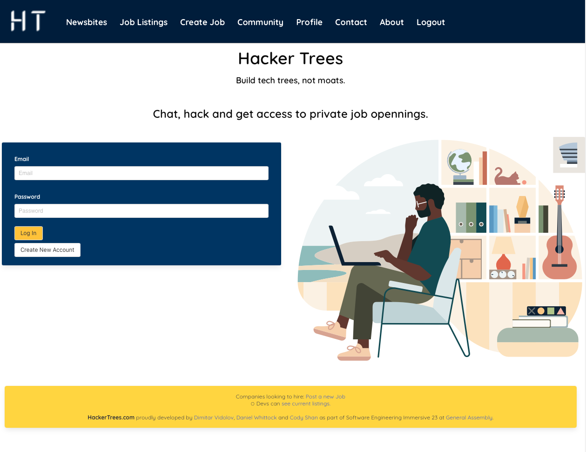
(navbar is shown for preview purposes, it us unavailable unless signed-in)

## Technologies used 

- React
- Node.js
- Mongoose
- Express
- MongoDB
- HTML
- CSS
- JavaScript
- Git and GitHub
- Bulma

## Approach

The idea from the beginning was to create a specialised professional network site for IT professionals. 
Me and my team wrote up user stories and wireframes using Miro:
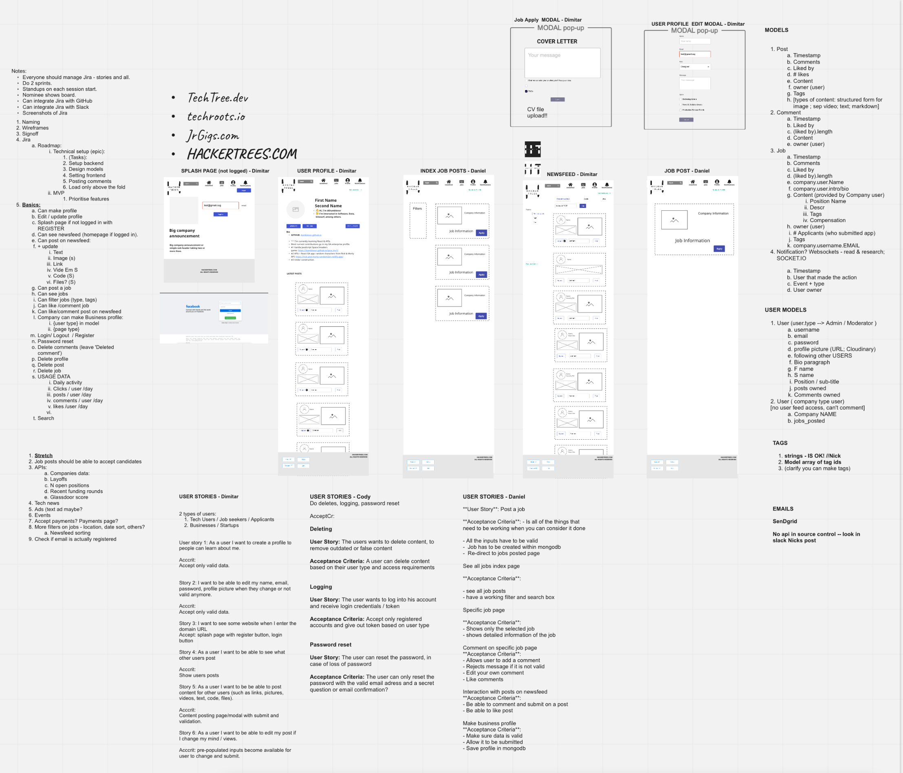

I took the lead on the social aspect of the site, including filtering, show/hide comments, tags, CRUD posts and comments, both on the fronend and backend. I also contributed to the home page, the middleware on the backend, the footer, about us page, login, register and logout. 

## Timeline
- Day 1 - Brainstorming & wireframes, user stories, pseudo models
- Day 2 - Boiler plate setup, Git setup, Jira, start of Sprint 1
- Day 4 - End of sprint 1, start of sprint 2
- Day 6 - End of sprint 2
- Day 7 - Deployment

## Jira setup 

My tickets are marked orange.

### Sprint 1:
#### MVP Roadmap
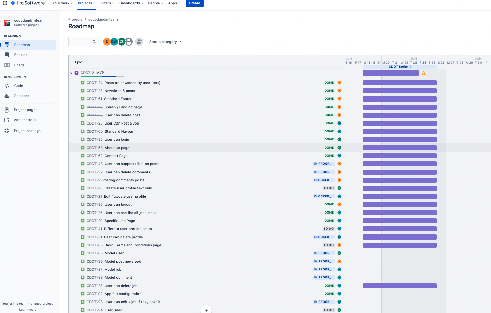

#### Initial Backlog
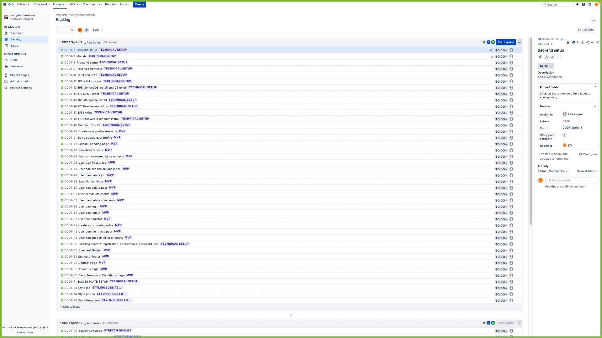

#### Backlog
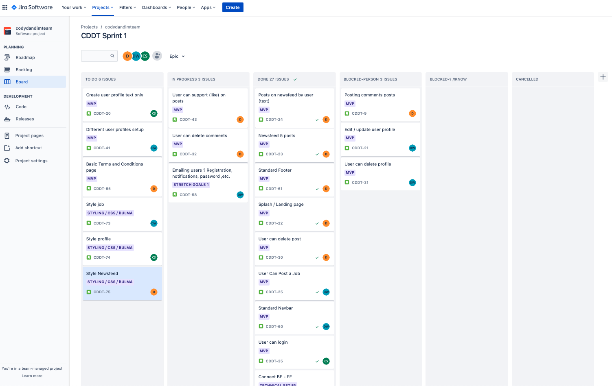

#### Stretchgoals
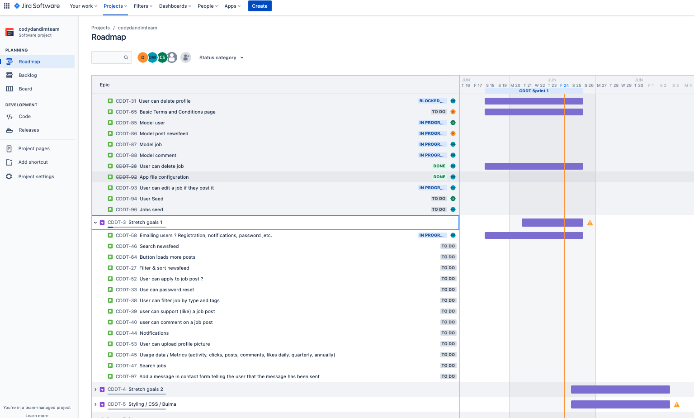

#### MVP done
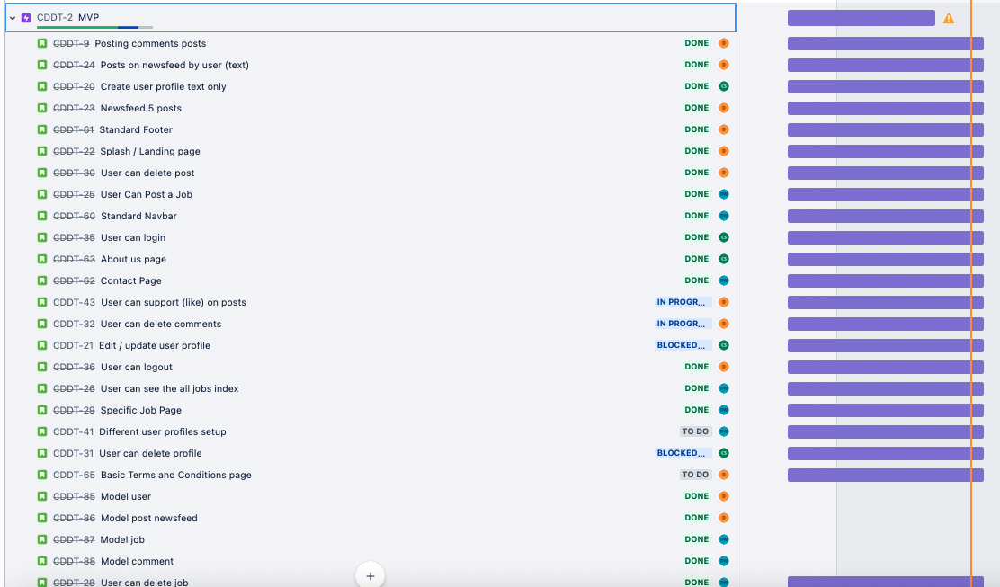

--------

### Sprint 2
#### Board
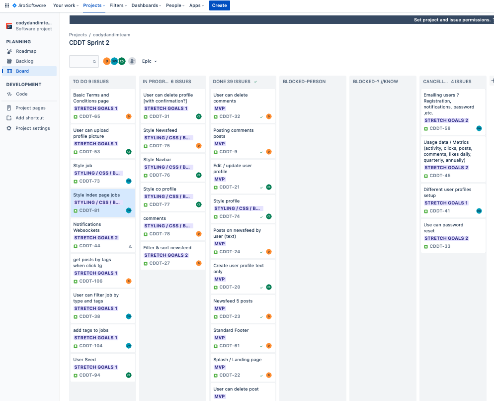

#### Backlog
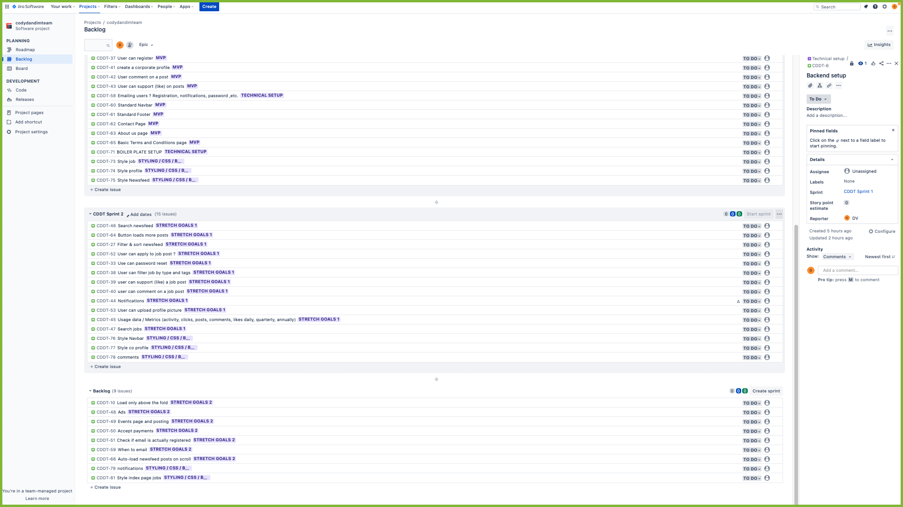

#### Roadmap
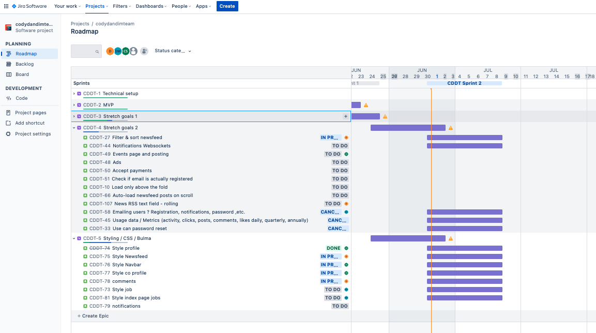

In total I completed 12 of 28 issues ~ 43% + initial teachnical, Git and Jira setups.

## Bugs, Wins & Learnings
Many features that were stretch goals were not finished, including search for the whole site, filtering by tags, upvotes for posts.
It was a great project and there is a throve of features that can be added to make it a proper product. 

Working in team is fun and can get a lot done when the group is in sync. 
I personally learned quite a bit about react, router, state and bulma on this project. 

Final version of the newsfeed:
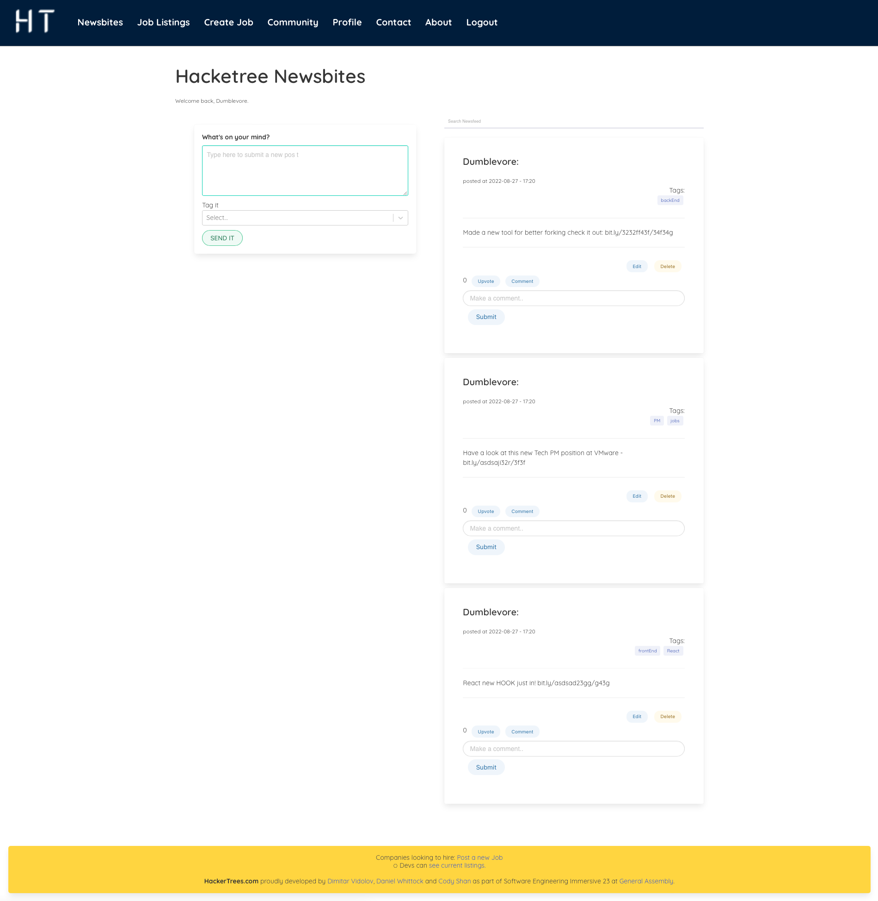

## Credits
- Logo: Dimitar Vidolov (via canva.com).
--------
