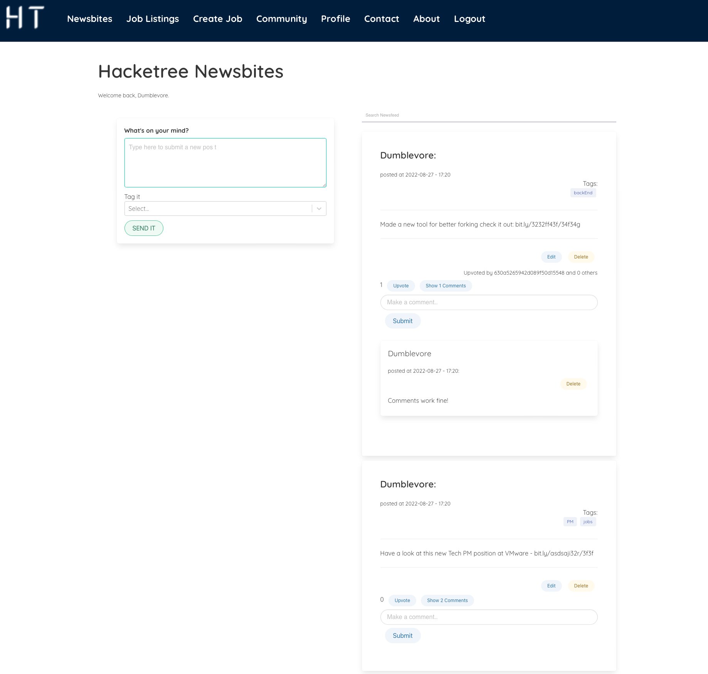

# hackertrees

## Overview

This is the third project of the software engineering immersive course at General Assembly London. The assignment was to create a full-stack website with React and Node.js. The project was to be completed **in a group** within **6 days** over 2 weeks. 

Preview: 
(navbar is shown for preview purposes, it's unavailable unless signed in)


## Technologies used 

- React
- Node.js
- Mongoose
- Express
- MongoDB
- HTML
- CSS
- JavaScript
- Git and GitHub
- Bulma

## Approach

The idea from the beginning was to create a specialised network site for IT professionals. 
My team and I wrote up user stories and wireframes using Miro:


I took the lead on the social aspect of the site, including filtering, showing and hiding comments, tags, CRUD posts and comments, both on the frontend and backend. I also contributed to the home page, the middleware on the backend, the footer, an about us page, a login, register and logout. 

We did almost no pseudo code unfortunately as we were quite pressed for time and wanted to get project signed off quicker.
Our main focus were the user stories and the data models.

## Timeline Overview
- Day 1 - Brainstorming, wireframes and user stories
- Day 2 - Boilerplate setup, Git setup, Jira, the start of Sprint 1
- Day 4 - End of sprint 1, the start of Sprint 2
- Day 6 - End of sprint 2
- Day 7 - Deployment


## Jira setup 
I setup our Jira account and it was off to the races.
My tickets are marked with an orange circle on the righ hand side. 
We prioritised by basic functionality first, and the more advanced features by whether we can build them and how long it would take us. 

### Sprint 1:
#### MVP Roadmap
Straghtforward startup, basic CRUD for elements.


#### Initial Backlog


#### Backlog
I also added a blocked by person and blocked by lack understanding, as well cancelled columns for more transperancy and practicallity.

It was also at this point that we realized that the User should've been done first as it started blocking the development of other tickets. 


#### Stretchgoals
Once we had CRUD, seeding and basic pages it was time for some more advanced features: 


#### MVP done


--------


### Sprint 2
#### Board


#### Backlog


#### Roadmap
There were some ambitious tickets in there for a few reasons:
1. We got excited we can build them, maybe. 
2. It gave us a perspective of how much more we could do.
3. And it was motivating us to get done more now.


In total I completed 12 of 28 issues ~ 43% + initial teachnical, Git and Jira setups.


## Wins
It was great to get posts and comments to appear and disappear immediately on button click. Post delete function updates on the backend and gets fresh data. Deleting the comment updates the backend and gets fresh posts data by pulling the function down from the newsfeed component as well.
All the posts also update with a time interval:

```
 useEffect(() => {
    getPostData()
    setInterval(() => {
      getPostData()
    }, 2000);
  }, [])
```

That way the user will see up-to-date data. 
Deleting comments and posts in real time using state really improves the UX. 

Search actually filters posts by post content similar to Hacker News. The idea was to filter by tags too, but ran out of time. 

I also added a show/hide button for the comments so the feed doesn't clutter with too many comments, used lodash and state to keep track which button is being clicked exactly:
```
 function handleShowCommentsButton(postID) {
    hiddenCommentsNumber.includes(postID)
      ? setHiddenCommentsNumber(_.remove(hiddenCommentsNumber, (postCheck) => postCheck._id !== postID._id))
      : setHiddenCommentsNumber([...hiddenCommentsNumber, postID])
  }
```

For the upvotes I had to make the model to keep an array of user IDs that liked it, check before allowing a new like to be recorded if the ID is not in the array else it doesn’t execute: 

```
sync function likePost(req, res) {
  try {
    const postID = req.params.postID
    const user = req.currentUser

    const post = await PostModel.findById(postID)
    if (!post) return res.json({ message: "This post cannot be found" })

    if (post.upvotedBy.includes(user._id) === false) {
      post.upvotedBy.push(user)
      const savedPostWithNewLike = await post.save()
      res.status(202).json(savedPostWithNewLike.upvotedBy)

    } else {
      return res.status(403).json({ message: "already liked" })
    }
  } catch (e) {
    console.log(e);
  }
}
```

## Future improvements & Learnings
Many features that were stretch goals were not finished, including search for the whole site, filtering by tags and notifications with web sockets for example.
It was a great project and there is a trove of features that can be added to make it a proper product, from enhanced posts & comments to accommodate different content, tagging users and everything else we are used to having in a social network.

Working as a team was good fun and can get a lot done when the group is in sync. 
I personally learned quite a bit about react, router, state and bulma on this project, building up on our previous react site. 
There is quite a bit that goes into a site like this one, though the basics are to get or send data to and from the backend. 

The final version of the newsfeed:



## Credits
- Logo: Dimitar Vidolov (via canva.com).
--------
